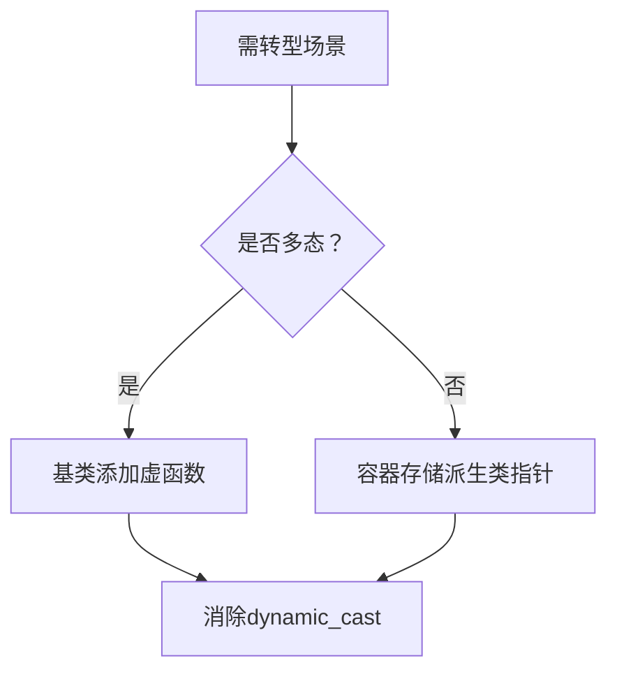

## **Effective C++ 条款27 ：尽量少做转型动作**

---

<br/>


### ⚙️ **一、C++转型操作的分类与语法**

#### **1. 旧式转型（C风格）**

- **语法形式**：
  - `(T)expression`（强制转换）
  - `T(expression)`（函数式转换）  
  二者功能等价，但缺乏类型安全性，易隐藏错误。

#### **2. 新式转型（C++风格）**

新式转型分为四类，各司其职：  

| **转型类型**       | **用途**                                                        | **示例场景**                                                            |
| ------------------ | --------------------------------------------------------------- | ----------------------------------------------------------------------- |
| `const_cast`       | 移除或添加`const`属性（唯一能去除常量性的操作符）               | 修改指向非常量内存的`const`指针：`int* p = const_cast<int*>(const_ptr)` |
| `dynamic_cast`     | 多态类型的安全向下转型（运行时检查，失败返回`nullptr`或抛异常） | 基类指针转派生类指针：`Derived* d = dynamic_cast<Derived*>(base_ptr)`   |
| `reinterpret_cast` | 低级别重新解释（如指针转整数），平台依赖性强且不安全            | 内存地址操作：`int* p = reinterpret_cast<int*>(0x1000)`                 |
| `static_cast`      | 编译器信任的隐式转换（如数值类型转换、基类转派生类*无检查*）    | `double d = static_cast<double>(int_val)` 或 非多态继承中的指针转换     |

**新式转型优势**：  
- **可读性**：明确标识转换意图，便于代码审查；  
- **安全性**：编译器可检查非法转换（如`const_cast`不可改变类型）。

---

### ⚠️ **二、转型操作的潜在风险与性能影响**

#### **1. 破坏类型安全与对象布局**

- **临时对象问题**：  
  派生类对象转型为基类时，可能生成临时副本，而非操作原对象：  
  ```cpp
  class SpecialWindow : public Window {
  public:
      void onResize() {
          static_cast<Window>(*this).onResize(); // 错误！操作临时副本
          // 正确做法：Window::onResize();  // 直接调用基类方法
      }
  };
  ```
- **内存布局不确定性**：  
  多重继承中，基类子对象地址可能与派生类地址不同，指针偏移由运行时决定。手动计算偏移（如`reinterpret_cast`）会导致平台依赖性问题。

#### **2. 性能开销**

- **`dynamic_cast`的高成本**：  
  某些实现基于字符串比较类名（如深度继承需多次`strcmp`），导致性能显著下降：  
  ```cpp
  // 深度继承体系中的dynamic_cast可能耗时
  Base* base = new Derived();
  auto start = std::chrono::high_resolution_clock::now();
  Derived* derived = dynamic_cast<Derived*>(base);  // 可能耗费毫秒级时间
  ```
- **数值类型转换的隐藏成本**：  
  `int`转`double`等操作可能触发底层指令，非零成本操作。

#### **3. 代码可维护性降低**

- **“连串dynamic_cast”陷阱**：  
  多态类型判断时，`if-else`链式转型导致代码臃肿且易漏分支：  
  ```cpp
  for (auto& w : windows) {
      if (auto sw1 = dynamic_cast<SpecialWindow1*>(w)) sw1->blink();
      else if (auto sw2 = dynamic_cast<SpecialWindow2*>(w)) sw2->blink(); // 新增类型需修改此处
  }
  ```

---

### 🛠️ **三、转型的正确使用场景与替代方案**

#### **1. 必要场景与安全实践**
- **`const_cast`的合理使用**：  
  修改**非真正常量**的数据（如第三方库遗留的`const`错误声明）。
- **多态向下转型**：  
  当基类接口无法扩展时，用`dynamic_cast`访问派生类特有方法（需确保基类含虚函数）。

#### **2. 避免转型的替代设计**

| **场景**             | **替代方案**                                                             | **优势**                         |
| -------------------- | ------------------------------------------------------------------------ | -------------------------------- |
| 需调用基类方法       | 直接使用作用域运算符：`BaseClass::method()`                              | 避免临时对象生成                 |
| 多态类型需派生类操作 | **方案1**：基类添加虚函数（如`virtual void blink() {}`）                 | 消除`dynamic_cast`，支持开闭原则 |
|                      | **方案2**：容器直接存储派生类智能指针（如`vector<shared_ptr<Derived>>`） | 类型安全，无转型开销             |
| 数值类型转换         | 初始化时声明正确类型：`double d = int_val * 1.0;`                        | 避免显式转型                     |



#### **3. 转型封装技巧**
将转型隐藏在接口背后，用户通过函数调用而非直接转型：  
```cpp
class SecurityContext {
public:
    static User* getCurrentUser() {
        // 内部封装dynamic_cast
        return dynamic_cast<User*>(getAuthObject());
    }
};
```

---

### 💎 **四、最佳实践总结**

1. **优先避免转型**：  
   - 通过多态、接口设计或类型安全容器消除需求；  
   - 数值运算使用正确类型避免转换。

2. **必须转型时遵循**：  
   - **用新式转型**：明确意图且易排查问题；  
   - **封装转型逻辑**：隐藏于函数内，减少调用方依赖；  
   - **性能敏感代码禁用`dynamic_cast`**：实测表明其开销可达`static_cast`的**1.2倍+**。

3. **特殊注意事项**：  
   - **对象布局不可假设**：避免基于内存偏移的指针运算（如`reinterpret_cast`操作结构体内存）；  
   - **临时对象陷阱**：派生类转基类时慎用值类型转型，可能操作副本而非原对象。

> “**转型是C++类型系统的逃生口，但频繁使用意味着设计缺陷。**” —— 条款27的核心在于**通过设计而非强制转换解决问题**，确保代码高效、安全且易于演化。
