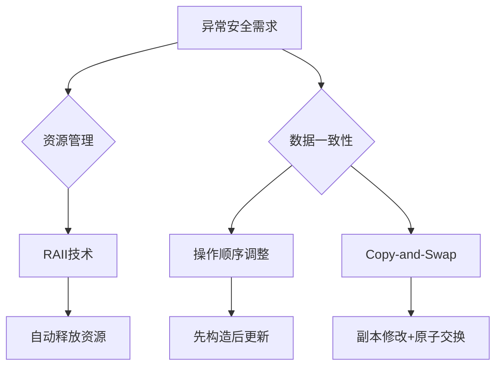

## **Effective C++ 条款29 ：为异常安全努力是值得的**

---

<br/>

### ⚙️ **一、异常安全的核心原则与分级体系**

#### **1. 异常安全的两大基本要求**

- **资源不泄漏**：即使抛出异常，已分配的资源（内存、锁、句柄等）必须被释放。
- **数据不破坏**：对象状态必须保持有效，避免出现部分修改导致的逻辑错误。

#### **2. 三级异常安全保证**

| **保证级别**     | **核心要求**                                                               | **适用场景**                                         |
| ---------------- | -------------------------------------------------------------------------- | ---------------------------------------------------- |
| **基本保证**     | 异常抛出后，所有对象处于有效状态（内部约束满足），但状态可能与调用前不同。 | 多数场景的最低要求（如数据库连接中断后连接池仍有效） |
| **强烈保证**     | 异常抛出后，程序状态完全回滚至调用前的状态（原子性操作）。                 | 事务性操作（如金融交易）                             |
| **不抛异常保证** | 函数承诺绝不抛出异常（如`noexcept`声明），通常用于简单操作或关键基础设施。 | 移动操作、析构函数等关键路径                         |

---

### ⚠️ **二、异常安全问题的典型场景与解决策略**

#### **1. 案例：资源泄漏与数据破坏**  
以下代码同时违反资源不泄漏和数据不破坏原则：  
```cpp
class PrettyMenu {
    Mutex mutex;        // 互斥锁
    Image* bgImage;     // 原始指针管理资源
    int imageChanges;   // 修改计数器
public:
    void changeBackground(std::istream& imgSrc) {
        lock(&mutex);           // 获取锁
        delete bgImage;         // 删除旧图
        ++imageChanges;         // 计数器递增
        bgImage = new Image(imgSrc); // 可能抛出异常！
        unlock(&mutex);         // 若异常则永不执行
    }
};
```
**风险分析**：  
- 若`new Image`抛出异常，`mutex`永久锁死（资源泄漏）；  
- `bgImage`指向已释放内存（悬空指针），`imageChanges`却已递增（数据不一致）。

#### **2. 解决方案：RAII与智能指针**  

**资源泄漏问题 → 使用RAII管理资源**  
```cpp
void changeBackground(std::istream& imgSrc) {
    std::unique_lock<std::mutex> lock(mutex); // 自动释放锁
    bgImage.reset(new Image(imgSrc));         // 智能指针自动释放旧资源
    ++imageChanges;
}
```
- **原理**：`unique_lock`和`shared_ptr`在析构时自动释放资源，避免手动管理。

**数据破坏问题 → 调整操作顺序**  
```cpp
void changeBackground(std::istream& imgSrc) {
    std::unique_lock<std::mutex> lock(mutex);
    auto newImage = std::make_shared<Image>(imgSrc); // 先构造新资源
    ++imageChanges;                // 后更新计数器（若构造失败则计数器不变）
    bgImage = std::move(newImage); // 最后替换指针
}
```
- **关键**：**“除非事件真实发生，否则不更新状态”**。

---

### 🔍 **三、实现强烈保证的核心策略：Copy-and-Swap**

#### **1. 原理与步骤**

1. **创建副本**：复制原对象到临时副本；
2. **修改副本**：在副本上执行可能抛出异常的操作；
3. **原子交换**：若修改成功，通过`swap`将副本与原对象交换（`swap`需声明为`noexcept`）。

#### **2. 结合Pimpl惯用法的实现**

```cpp
struct PMImpl { // 封装数据
    std::shared_ptr<Image> bgImage;
    int imageChanges = 0;
};

class PrettyMenu {
    std::mutex mutex;
    std::shared_ptr<PMImpl> pImpl; // 指向数据实体
public:
    void changeBackground(std::istream& imgSrc) {
        using std::swap;
        std::unique_lock lock(mutex);
        auto pNew = std::make_shared<PMImpl>(*pImpl); // 1. 创建副本
        pNew->bgImage.reset(new Image(imgSrc));      // 2. 修改副本
        ++pNew->imageChanges;
        swap(pImpl, pNew); // 3. 交换（swap通常为noexcept）
    }
};
```
**优势**：  
- 若`new Image`失败，`pImpl`保持不变（强烈保证）；  
- 若成功，通过原子交换更新状态。

#### **3. 局限性**  
- **性能开销**：深拷贝大对象代价高昂；  
- **外部副作用**：若函数影响外部状态（如写入文件），则无法回滚。

---

### ⚖️ **四、异常安全实践的综合指导原则**

1. **优先使用RAII**：  
   资源管理类（如智能指针、锁守卫）是避免资源泄漏的基石。  

   *表：RAII技术的优势与实现*

   | **资源类型** | **RAII封装类**      | **关键行为**           |
   | ------------ | ------------------- | ---------------------- |
   | 互斥锁       | `std::unique_lock`  | 析构时自动解锁         |
   | 动态内存     | `std::shared_ptr`   | 引用计数归零时释放内存 |
   | 文件句柄     | 自定义`FileHandler` | 析构时自动关闭文件     |

3. **明确安全级别**：  
   - 基本保证是底线，强烈保证需评估成本，`noexcept`用于关键路径；  
   - 函数的安全级别受其调用函数的最弱保证限制（木桶效应）。

4. **谨慎设计接口**：  
   - 避免在构造/析构中调用虚函数（条款9）；  
   - 为可能失败的操作提供专用接口（而非依赖析构函数）。

---



### 💎 **总结**

条款29的核心在于**通过设计而非事后修补实现异常安全**：  
1. **资源管理对象化**：RAII是防止泄漏的核心机制；  
2. **状态更新原子化**：通过副本操作+交换实现回滚能力；  
3. **保证级别现实化**：根据场景选择合理的安全级别，避免过度追求强烈保证导致性能损失。  
> “异常安全不是可选项，而是健壮C++代码的必需品。”——Scott Meyers

<br/>  

## **异常处理机制**

---

<br/>

> 在C++中，异常抛出（`throw`）和异常捕获（`catch`）是异常处理机制的两个核心环节，二者分工明确但紧密协作。而`noexcept`函数内出现未处理异常则会导致程序立即终止，其行为与常规异常处理有显著差异。
{: .prompt-info}

---

### 🔧 **一、异常抛出（Throw）与捕获（Catch）的区别**

#### **1. 角色与目的**

- **抛出（`throw`）**：  
  当程序检测到无法处理的错误（如无效输入、资源不足）时，**主动创建异常对象并中断当前执行流**。抛出操作将异常对象传递给调用栈的上层，触发栈展开（Stack Unwinding）。  
  **示例**：  
  ```cpp
  void readFile(const std::string& path) {
      if (!fileExists(path)) 
          throw std::runtime_error("File not found"); // 抛出异常
  }
  ```

- **捕获（`catch`）**：  
  在`try`块中**监控可能抛出的异常**，并通过`catch`块匹配异常类型进行处理。捕获的目的是**恢复程序状态或优雅降级**，避免崩溃。  
  **示例**：  
  ```cpp
  try {
      readFile("data.txt");
  } catch (const std::runtime_error& e) { // 捕获特定异常
      std::cerr << "Error: " << e.what(); // 处理异常
  }
  ```

#### **2. 执行流程差异**

| **特性**     | **抛出（`throw`）**                              | **捕获（`catch`）**                                            |
| ------------ | ------------------------------------------------ | -------------------------------------------------------------- |
| **触发时机** | 主动检测错误时                                   | 异常被抛出后                                                   |
| **程序流程** | 立即中断当前函数，启动栈展开（依次析构局部对象） | 匹配`catch`块并执行其代码，之后继续执行`try-catch`块之后的语句 |
| **处理位置** | 通常在函数内部                                   | 必须在`try`块后的`catch`块中                                   |
| **设计目的** | 传递错误信号                                     | 消化错误并恢复程序                                             |

#### **3. 类型匹配规则**

- **严格类型匹配**：`catch`需精确匹配`throw`的异常类型（如`throw int`需`catch(int)`），但允许基类捕获派生类异常（多态）。
- **`catch(...)`通配符**：可捕获任意类型异常，但无法获取具体信息，通常用于日志记录或资源清理。

---

### ⚠️ **二、`noexcept`函数内出现异常的行为**

#### **1. 立即终止程序**

若`noexcept`函数内部抛出异常且**未在函数内部捕获**（即未用`try-catch`内部消化），程序将**直接调用`std::terminate()`终止运行**，不会进行栈展开（Stack Unwinding），导致以下后果：  
- **资源泄漏**：局部对象的析构函数不会被调用（如未释放堆内存、未关闭文件句柄）。
- **无错误恢复**：无法通过外层`try-catch`捕获此异常。
- **调试困难**：终止时可能仅输出简单错误信息（如“terminate called after throwing an instance of ...”），缺乏完整调用栈。

**示例**：  
```cpp
void riskyOperation() noexcept {
    throw std::logic_error("Oops"); // 未捕获 → 立即终止
}
int main() {
    riskyOperation(); // 程序终止，无栈展开
    return 0;
}
```

#### **2. 安全使用`noexcept`的实践**

- **内部捕获异常**：在`noexcept`函数内部用`try-catch`消化异常，避免传播：  
  ```cpp
  void safeOperation() noexcept {
      try {
          // 可能抛出异常的代码
      } catch (...) { // 捕获所有异常
          // 记录日志或恢复状态
      }
  }
  ```
- **仅用于真正无异常的函数**：如简单计算、移动操作、析构函数等。
- **性能关键场景**：`noexcept`允许编译器优化（如省略栈展开准备），提升效率。

---

### 💎 **三、综合对比与最佳实践**

#### **1. 抛出 vs 捕获 vs `noexcept` 的适用场景**

| **场景**                       | **推荐方式**   | **原因**                                            |
| ------------------------------ | -------------- | --------------------------------------------------- |
| 可恢复的错误（如用户输入无效） | 抛出并捕获     | 提供详细错误信息，允许程序继续运行                  |
| 不可恢复的错误（如内存耗尽）   | 抛出但不捕获   | 由顶层`catch`记录日志后终止，避免无效状态蔓延       |
| 确保无异常的函数（如移动构造） | 声明`noexcept` | 提升性能（如`std::vector`重分配时使用移动而非拷贝） |
| 资源清理                       | RAII + 捕获    | 析构函数自动释放资源，与异常处理解耦                |

#### **2. 异常安全的核心原则**

- **RAII优先**：用智能指针（`std::unique_ptr`）、锁守卫（`std::lock_guard`）管理资源，即使异常发生也能自动释放。
- **避免析构函数抛异常**：C++默认析构函数为`noexcept`，若显式抛出异常会二次触发`terminate`。
- **谨慎使用`noexcept`**：除非确定函数无异常，否则滥用可能导致意外终止。

---

**总结**：  
⛓️ **抛出是错误信号的发起者**，通过栈展开传递异常；**捕获是错误的中和处理者**，恢复程序状态；而**`noexcept`是异常传播的阻断器**，其内部未处理异常将直接终结程序。  
⚖️ 在实际开发中，应结合**RAII资源管理**、**精准的异常捕获**与**审慎的`noexcept`声明**，构建健壮且高效的异常处理体系。
