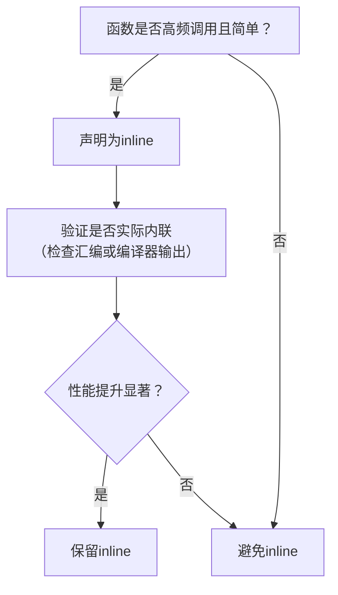

## **Effective C++ 条款30 ：透彻了解inlining的里里外外**

---

<br/>

### 🔧 **一、内联函数的核心机制**

1. **定义与作用**  
   - **原理**：编译器将函数体代码直接插入调用点，避免函数调用开销（压栈、跳转、返回）。  
   - **语法**：显式使用`inline`关键字，或在类定义内隐式定义成员函数（自动视为内联）：  
     ```cpp
     // 显式定义
     inline int add(int a, int b) { return a + b; } 
     // 隐式定义（类内定义成员函数）
     class MyClass { int sum(int a, int b) { return a + b; } };
     ```

2. **编译行为**  
   - `inline`仅是**建议**，编译器可能拒绝复杂函数（如含循环、递归）的内联请求。  
   - 内联函数需在**头文件定义**，确保编译器在每个调用点可见函数体。

---

### ⚖️ **二、内联的优缺点分析**

#### **优点**  
- **性能提升**：消除调用开销，适合小型高频函数（如简单访问器）：  
  ```cpp
  inline double pi() { return 3.14; }  // 调用时直接替换为3.14
  ```
- **避免传参开销**：直接操作上下文数据，无需参数传递。

#### **缺点**  
1. **代码膨胀**  
   多次调用导致函数体重复插入，增大可执行文件体积：  
   ```cpp
   inline int sum(int a, int b) { return a + b; }
   void foo() { sum(1, 2); }  // 插入代码
   void bar() { sum(2, 3); }  // 再次插入代码
   ```

2. **二进制兼容性破坏**  
   修改内联函数需**所有调用方重新编译**；非内联函数仅需重新链接。

---

### ⚠️ **三、与其他特性的交互与限制**

1. **虚函数（virtual）**  
   - 虚函数调用在运行时动态绑定，**无法内联**（除编译器可确定具体类型的少数场景）：  
     ```cpp
     class Base { 
     public: 
         inline virtual void foo() {}  // 通常无效
     };
     ```

2. **函数指针**  
   通过函数指针调用内联函数时，**内联失效**（运行时才能确定调用地址）：  
   ```cpp
   inline void f() {}
   void (*pf)() = f;
   f();  // 可能内联
   pf(); // 无法内联
   ```

3. **构造/析构函数**  
   编译器会在构造/析构中插入额外代码（如基类构造、成员初始化），即使声明`inline`也**难以真正内联**。

4. **模板（template）**  
   模板函数**非自动内联**，仅当函数简单且明确需内联时才应添加`inline`：  
   ```cpp
   template<typename T>
   inline T add(T a, T b) { return a + b; }  // 明确内联
   ```

---

### 📊 **四、内联适用性决策指南**

| **场景**                   | **是否内联** | **原因**                       |
| -------------------------- | ------------ | ------------------------------ |
| 小型工具函数（<5行）       | ✅            | 性能收益显著，代码膨胀可控     |
| 高频调用的访问器（getter） | ✅            | 避免调用开销                   |
| 虚函数                     | ❌            | 动态绑定与内联静态替换冲突     |
| 复杂函数（含循环/递归）    | ❌            | 编译器通常拒绝，且代码膨胀严重 |
| 跨模块接口函数             | ❌            | 避免重新编译依赖               |

---

### 💎 **五、最佳实践总结**

1. **优先适用场景**  
   - 简单、高频调用的函数（如`getter`、数学工具函数）。  
   - 需避免宏缺陷的短小函数（如类型安全的`max`模板）。

2. **避免滥用**  
   - **性能敏感模块**：通过性能测试决定是否内联，而非主观猜测。  
   - **公共接口**：避免因内联改动导致用户频繁重新编译。

3. **调试与优化平衡**  
   - 内联函数**难以设置断点**，调试时禁用内联（如gcc的`-fno-inline`）。  
   - **增量优化**：初期写为非内联，性能分析后再针对性内联关键路径。



> **Scott Meyers的忠告**：  
> “限制内联在小型、频繁调用的函数上，使调试和二进制升级更易管理，并最小化潜在膨胀问题。”  
> 内联是性能优化的利器，但需在理解其编译行为与成本后审慎使用。
