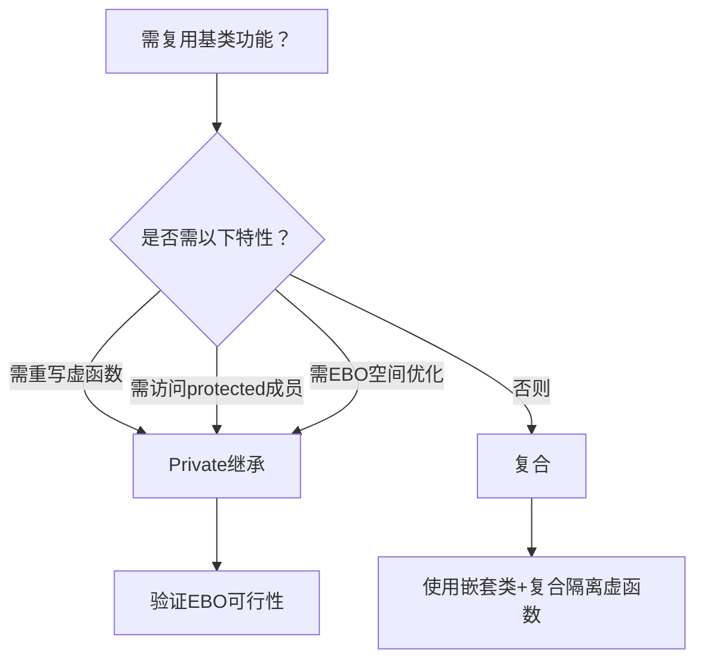
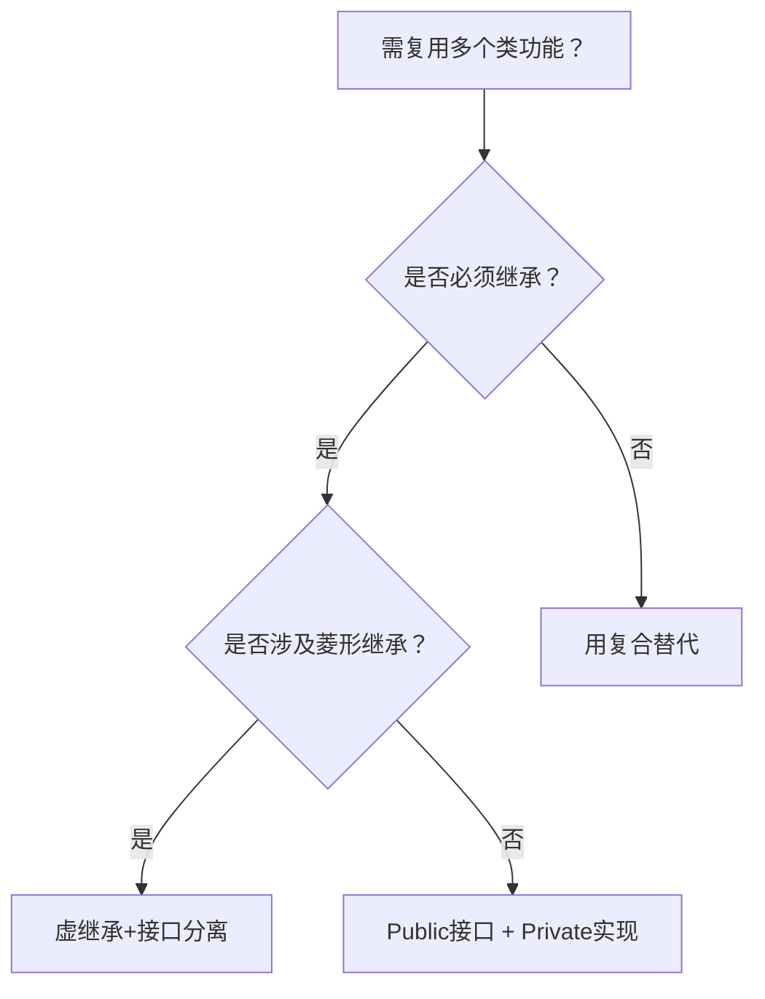

## **Effective C++ 条款39 ：明智而审慎地使用private继承”**

---

<br/>

### ⚙️ **一、Private继承的本质与规则**

#### 1. **核心语义：实现复用，而非接口继承**
- **与public继承的对比**  
  - Public继承：建立 **is-a** 关系，派生类是基类的子类型，支持多态和接口继承。  
  - Private继承：派生类仅复用基类实现，**不暴露基类接口**，不满足里氏替换原则。  
  ```cpp
  class Timer { public: virtual void onTick() const; };
  class Widget : private Timer {  // Widget不是Timer，仅复用其计时逻辑
  private:
      virtual void onTick() const override;  // 重写虚函数，但保持私有
  };
  ```
- **编译器行为**  
  - 禁止派生类到基类的隐式转换（违反is-a）。  
  - 基类的所有成员（包括public）在派生类中变为**private**，外部无法访问。

#### 2. **设计意图**  
Private继承的代码意图是：**“我需要基类的某些功能来实现我的逻辑，但不想暴露这些实现细节”**。

---

### 🎯 **二、适用场景：何时选择private继承**

#### 1. **需要重写基类虚函数**  
当派生类需定制基类虚函数逻辑，但**不希望暴露基类接口**时。  
- **示例**：`Widget` 复用 `Timer` 的计时机制，重写 `onTick()` 实现自定义回调。  
- **限制**：若需阻止派生类的派生类重写虚函数，需改用复合（见下文）。

#### 2. **空基类优化（EBO, Empty Base Optimization）**  
- **问题**：空类（无成员变量）作为成员时占用至少1字节，导致空间浪费。  
  ```cpp
  class Empty {}; // 大小=1（C++要求独立对象非零大小）
  class Holder { 
      int x; 
      Empty e; // 总大小≥8（int+填充） 
  };
  ```
- **EBO解决方案**：通过private继承，编译器优化基类空间，派生类大小仅等于自身成员大小。  
  ```cpp
  class Holder : private Empty {  // EBO生效
      int x;  // 总大小=4
  };
  ```
- **适用条件**：基类无成员变量（可能含 `typedef`、`static` 成员等），且为**单一继承**。

#### 3. **访问基类protected成员**  
当派生类需直接访问基类的protected成员或函数时，private继承提供权限，而复合无法直接访问。

---

### ⚖️ **三、Private继承 vs 复合（Composition）**

复合（在类中包含成员对象）是更常用的实现复用手段，但二者有显著差异：  

| **场景**              | **Private继承**           | **复合**                                |
| --------------------- | ------------------------- | --------------------------------------- |
| 重写虚函数            | ✅ 直接支持 （不隔离多态） | ❌ 需嵌套类+继承（禁止进一步重写虚函数） |
| 访问基类protected成员 | ✅ 直接访问                | ❌ 无法访问                              |
| 空基类优化（EBO）     | ✅ 空间优化至0             | ❌ 成员至少占1字节                       |
| 降低代码耦合          | ❌ 需基类定义              | ✅ 可通过指针+前置声明解耦               |
| 阻止进一步重写虚函数  | ❌ 派生类仍可重写          | ✅ 嵌套类私有化可封锁                    |

#### **复合替代方案示例**  
用嵌套类封装基类虚函数，彻底隔离实现：  
```cpp
class Widget {
private:
    class WidgetTimer : public Timer {  // 嵌套类public继承
        void onTick() const override;  
    };
    WidgetTimer timer;  // 复合管理
};
```
**优势**：  
- 禁止 `Widget` 的派生类重写 `onTick()`（因 `WidgetTimer` 私有）。  
- 仅需前置声明 `Timer`，减少编译依赖。

---

### ⚠️ **四、风险与使用准则**

#### 1. **谨慎使用EBO**  
- EBO仅在单一继承且基类无数据成员时有效，多重继承可能破坏优化。  
- 现实中的“空类”常含 `static` 成员或类型定义，需验证实际大小。

#### 2. **优先选择复合**  
除非需要上述特定场景（虚函数重写、protected访问或EBO），**否则复合更安全**：  
- 更好的封装性  
- 更灵活的编译依赖管理  
- 避免继承关系的强耦合。

#### 3. **避免误用为多态工具**  
Private继承**不提供动态多态**，基类指针无法指向派生类对象。若需多态，应使用public继承+虚函数。

---

### 💎 **五、总结：决策路径图**



> 📌 **Scott Meyers 核心忠告**：  
> *“Private继承意味着‘根据某物实现出’。它是实现复用的工具，而非类型设计工具。若需复用实现，先考虑复合；仅当复合无法满足时，才审慎选择private继承。”* 
---   

<br/>   

## **Effective C++ 条款40 ：明智而审慎地使用多重继承”**

---

<br/>

### ⚠️ **一、多重继承的固有复杂性**

多重继承允许派生类同时继承多个基类，但引入两类核心问题：
#### 1. **歧义性（Ambiguity）**

   - **问题本质**：多个基类包含同名成员时，编译器无法自动确定调用路径。
   - **示例**：
     ```cpp
     class BorrowableItem { public: void CheckOut(); };
     class ElectronicGadget { private: bool CheckOut() const; }; // 同名但私有
     class MP3Player : public BorrowableItem, public ElectronicGadget {};

     MP3Player mp;
     mp.CheckOut(); // 错误！歧义（不区分访问权限）
     ```
   - **解决方式**：**显式限定作用域**：
     ```cpp
     mp.BorrowableItem::CheckOut(); // 正确（public权限）
     mp.ElectronicGadget::CheckOut(); // 错误（private权限）
     ```

#### 2. **菱形继承（Diamond Problem）**

   - **问题本质**：派生类通过不同路径多次继承同一基类，导致基类子对象重复。
     ```cpp
     class File { protected: std::string fileName; };
     class InputFile : public File {};
     class OutputFile : public File {};
     class IOFile : public InputFile, public OutputFile {}; // 含两份fileName
     ```
   - **解决方案**：**虚继承（Virtual Inheritance）**
     ```cpp
     class InputFile : virtual public File {};  // 虚继承
     class OutputFile : virtual public File {}; // 虚继承
     class IOFile : public InputFile, public OutputFile {}; // 仅一份File子对象
     ```
   - **代价**：
     - **空间开销**：虚基类指针增加对象大小。
     - **初始化复杂**：虚基类由最派生类直接初始化（即使非直接继承）。
     - **访问速度**：通过虚基类指针间接访问成员，效率略低。

---

### 🔧 **二、虚继承的适用性与限制**

| **场景**           | **非虚继承**     | **虚继承**                 |
| ------------------ | ---------------- | -------------------------- |
| **基类子对象数量** | 多个（路径独立） | 唯一（共享）               |
| **初始化责任**     | 直接基类负责     | 最派生类直接初始化         |
| **适用性**         | 基类无重复风险时 | 必须解决菱形继承时         |
| **优化建议**       | 默认选择         | 避免在虚基类中放置数据成员 |

> 📌 **关键准则**：虚继承应作为“不得已而为之”的解决方案，尤其避免在虚基类中包含数据成员（仅保留接口）。

---

### 🎯 **三、多重继承的合理使用场景**

#### 1. **接口与实现分离（Public + Private 组合）**

   - **设计模式**：
     - **Public继承接口类**（纯虚函数，无数据）。
     - **Private继承工具类**（复用实现，不暴露接口）。
   - **示例**：
     ```cpp
     class Interface { public: virtual void process() = 0; }; // 接口类
     class Helper { protected: void assist(); };             // 实现工具类
     class Derived : public Interface, private Helper {     // 组合继承
     public:
         virtual void process() override { assist(); }      // 复用Helper实现
     };
     ```
   - **优势**：  
     明确区分对外接口（`Interface`）与内部实现（`Helper`），避免歧义与数据冗余。

#### 2. **替代方案：复合优于多重继承**

   - **复合（Composition）更安全**：  
     若非必须继承关系，优先用成员对象组合功能：
     ```cpp
     class Derived : public Interface {
     private:
         Helper helper;  // 复合而非继承
     public:
         virtual void process() override { helper.assist(); }
     };
     ```
   - **何时选择继承**：仅需重写虚函数或访问基类protected成员时。

---

### ⚖️ **四、多重继承的决策准则**

1. **优先单一继承或复合**：  
   若单一继承或组合可满足需求，**避免引入MI**。
2. **警惕菱形结构**：  
   若继承图可能出现菱形，**立即评估虚继承必要性**（并承担其成本）。
3. **接口类保持纯净**：  
   多重继承中，public继承的基类应为**纯接口类**（无数据成员，仅纯虚函数）。
4. **工具类私有化**：  
   实现辅助类通过private继承或复合嵌入，**禁止多态泄露**。
5. **虚基类无状态化**：  
   必须虚继承时，虚基类**不包含数据成员**，仅声明接口以减少初始化负担。

---

### 💎 **五、总结：多重继承的适用边界**



> 📌 **Scott Meyers 核心忠告**：  
> - “多重继承比单一继承复杂得多，可能引发歧义性并强迫使用虚继承及伴随的开销。”  
> - “唯一最适用的场景是：**组合‘Public继承接口类’与‘Private继承实现类’**，其他情况优先复合。”  

多重继承如同手术刀——在精确的场景下无可替代，但滥用则会导致设计失血。
